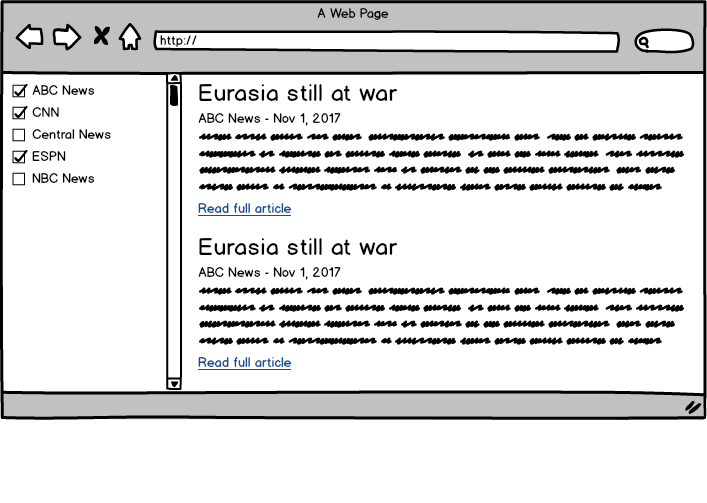

# Exercise: News Site

Using React, create a web application that takes news sources and top headlines from [News API](http://beta.newsapi.org/docs) and displays them.

Specifics:

* All news sources should be selected at first.
* Users can unselect news sources to prevent stories from that source from showing up.
* You should get all the top headlines and then filter them instead of making a new query when news sources are selected/unselected.
* You will need to sign up to News API and get an API key. Since this is a frontend-only application, the API key will have to be stored in your JavaScript.

A mockup of a possible design:

